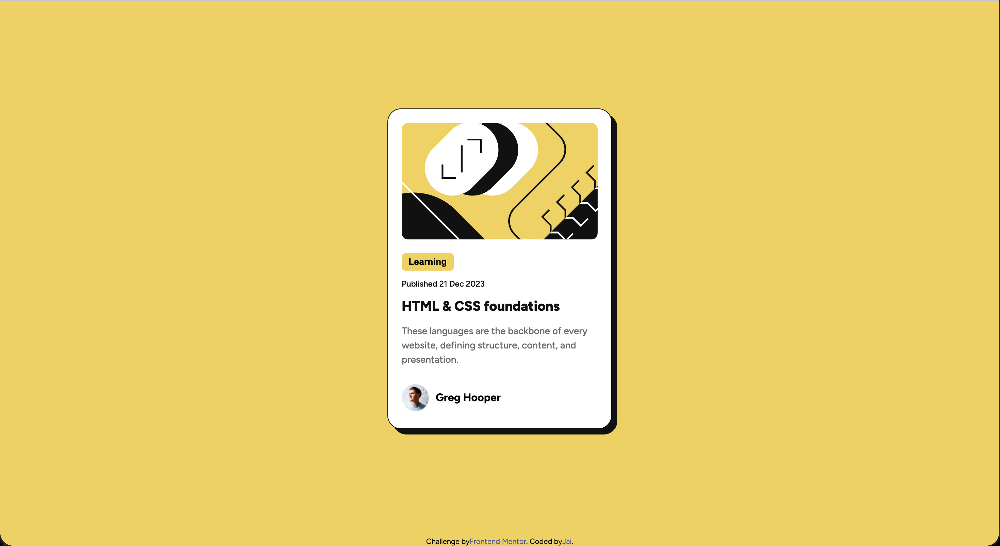

# Blog preview card solution

This is a solution to the [Blog preview card challenge on Frontend Mentor](https://www.frontendmentor.io/challenges/blog-preview-card-ckPaj01IcS). The goal of the project was to build a polished blog preview card using HTML and CSS while practicing layout, spacing, and responsive styling.

## Table of contents

- [Overview](#overview)
- [My process](#my-process)
- [Author](#author)

## Overview

### The challenge

Users should be able to:

- View the card content clearly and comfortably
- See hover and focus states for interactive elements
- Enjoy a responsive layout on different screen sizes

### Screenshot

### Links

- Live Site URL: https://smokemycode.github.io/blog-preview-card/

## My process

### Built with

- HTML5
- CSS3
- Flexbox
- Responsive layout techniques

### What I learned

I improved my understanding of building a simple UI component with semantic HTML and styling it with CSS. I also practiced using Flexbox for alignment, creating spacing between sections, and applying visual details like borders, shadows, and rounded corners.

### Continued development

I want to keep practicing responsive design, typography, and layout skills so I can build more polished and professional-looking web pages.

### Useful resources

- [Frontend Mentor](https://www.frontendmentor.io/) – Challenge source and design reference
- [MDN Web Docs](https://developer.mozilla.org/) – Helpful documentation for HTML and CSS

### AI Collaboration

I used GitHub Copilot while working on this project to help with debugging, improving the CSS structure, and organizing the layout more clearly. It was especially useful for spotting small issues and suggesting cleaner ways to style the card.

## Author

- Name: Jai
- Frontend Mentor: [@smokemycode](https://www.frontendmentor.io/profile/smokemycode)
